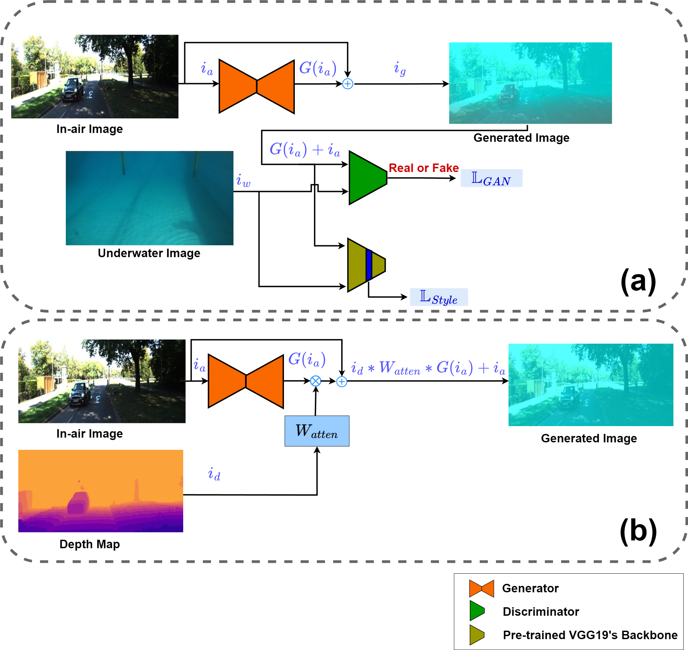

# Vit-ClarityNet: Underwater Image Enhancement with Vision Transformers

**Vit-ClarityNet** is a transformer-based CNN designed to enhance underwater images by overcoming challenges like light scattering, absorption, and poor illumination in underwater environments.

## Table of Contents
- [Introduction](#introduction)
- [Architecture](#architecture)
- [Dataset](#dataset)
- [Installation](#installation)
- [Usage](#usage)
- [License](#license)

## Introduction

**Vit-ClarityNet** is a transformer-based CNN that focuses on underwater image enhancement. The model is designed to tackle issues such as light scattering, absorption, and poor illumination typically found in underwater environments.

To support supervised training, we introduce **BlueStyleGAN**, a GAN-based synthetic dataset generator. BlueStyleGAN converts clear in-air images into their underwater counterparts, providing paired data for effective training of underwater image enhancement models.

## Architecture

Below are the simplified diagrams illustrating the architectures of **Vit-ClarityNet** and **BlueStyleGAN**:

- **Vit-ClarityNet Architecture**: This architecture integrates vision transformers and traditional CNN layers for effective underwater image enhancement.

  

- **BlueStyleGAN Architecture**: BlueStyleGAN is a GAN-based generator designed to convert clear in-air images into artificially attenuated underwater images. It enables the creation of synthetic datasets for paired supervised training.

  

## Dataset

To evaluate the performance of **Vit-ClarityNet**, we used the following underwater datasets:

- [USOD Dataset](https://irvlab.cs.umn.edu/resources/usod-dataset)
- [UIEB Dataset](https://li-chongyi.github.io/proj_benchmark.html)
- [EUVP Dataset](https://irvlab.cs.umn.edu/resources/euvp-dataset)
- [U45 Dataset](https://github.com/IPNUISTlegal/underwater-test-dataset-U45-)
- [SUIM Dataset](https://irvlab.cs.umn.edu/resources/suim-dataset)

Enhanced versions of these datasets, as well as training datasets generated from BlueStyleGAN using underwater-transferred images from the [KITTI Dataset](https://www.cvlibs.net/datasets/kitti/), are available for download through the following Google Drive link:

- [Google Drive Link](https://drive.google.com/drive/folders/1bobH4BGmL2AonNb-OWEnlbbNHGrkehYb)

## Installation

The implementation code for **Vit-ClarityNet** will be available soon. Stay tuned for updates!

## Usage

Once the code is released, you will be able to run **Vit-ClarityNet** on your underwater images using a simple command. Example usage will be provided.

For more details on the available command-line arguments, refer to the documentation, which will be included with the code release.

## License

This project is licensed under a custom license that restricts the usage of the code:

- **Non-commercial use only**: The Vit-ClarityNet method may not be used for commercial purposes without express permission from the author. If you are interested in using this method in commercial products or applications, please contact the author for licensing details.
  
Please see the `LICENSE` file for the full license text.
